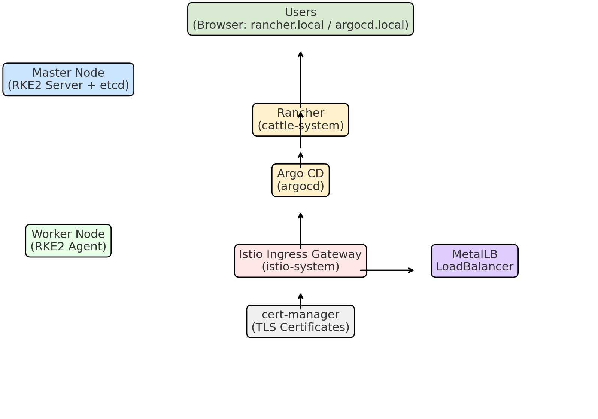

# 🚀 RKE2 Infra Cluster (Baremetal)

This repository demonstrates how to set up a **baremetal Kubernetes infra cluster** with:

- ✅ RKE2 (single-master)
- ✅ Rancher (cluster management UI)
- ✅ Argo CD (GitOps CD tool)
- ✅ MetalLB (LoadBalancer on baremetal)
- ✅ Istio (service mesh ingress)
- ✅ cert-manager (internal PKI / TLS certs)

It’s a practical **homelab / showcase project** that proves end-to-end skills in:
- Kubernetes (RKE2, CNI, PodSecurity)
- GitOps (ArgoCD)
- Multi-tenancy management (Rancher)
- Networking (Istio, MetalLB, Ingress, TLS)
- Certificates & Security (cert-manager, PSA)

---

## 🏗️ Architecture

---

## ⚡ Installation Guide

1. Install RKE2 Master
2. Join Worker Node
3. Deploy MetalLB
4. Deploy Istio
5. Install cert-manager
6. Deploy Rancher
7. Deploy ArgoCD
8. Configure Istio Gateway

Detailed manifests and scripts are provided in this repository.

---

## 🌐 Access the UIs

- Rancher → https://rancher.local
- ArgoCD → https://argocd.local

(Default certs are signed by internal CA → trust `cluster-root-ca` on your machine to remove browser warnings)

---

## 📖 Notes
- Single-master = not HA, just for demo/homelab
- Etcd snapshots recommended (`/etc/rancher/rke2/config.yaml`)
- Storage: use `local-path-provisioner` or NFS
- Minimum resources:  
  - Master: 4 CPU / 16GB RAM  
  - Worker: 4 CPU / 12GB RAM

---

## 🎯 Why This Project?

This repo showcases:
- Practical **baremetal Kubernetes setup**
- **GitOps with ArgoCD**
- **Service Mesh with Istio**
- **Cluster management with Rancher**
- Hands-on **networking, TLS, security**
